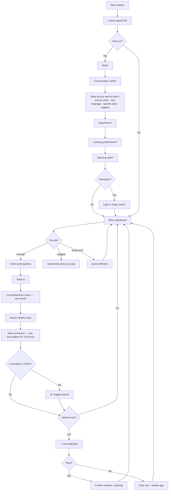

# GapHunter

<p align="center">
  
</p>

> The adaptive AI teacher that finds your weak spots and fills them —
> for developers, PMs, QA engineers, designers, and complete beginners.

Works on **Claude Code, Cursor, GitHub Copilot, Gemini CLI, JetBrains AI**,
and any LLM agent. Exports to **NotebookLM** after every session.

---

## For Everyone

GapHunter is not just for developers. It adapts to who you are:

| Role | What you get |
|------|-------------|
| Junior Dev | Analogies, patience, encouragement |
| Mid-level Dev | Balanced depth, real-world examples |
| Senior Dev | Dense mode, edge cases, no hand-holding |
| Team Lead | Architecture and team implications |
| Product Manager | Business analogies, understand WHY devs say what they say |
| QA Engineer | Connect concepts to quality, testing, and deploy pipelines |
| Designer | Visual analogies, understand components and constraints |
| ADHD / Dyslexia | Short chunks, bold terms, no walls of text |
| Complete Beginner | Zero assumed knowledge, everyday analogies only |

---

## How It Works



---

## ⏳ Learn While You Wait

AI generating code? Tests running? Build in progress?

Instead of switching tabs:

> `"teach me event-loop"`

3 minutes. One concept. Real retention. Streak maintained.

GapHunter is built for exactly this — short bursts that compound
into deep knowledge over time.

---

## 📓 NotebookLM Friendly

[NotebookLM](https://notebooklm.google.com) is a free Google tool.
You upload documents, then have a conversation about them — or listen
to an auto-generated podcast summarizing what you uploaded.

**GapHunter + NotebookLM workflow:**

1. Finish a GapHunter session
2. Type `export session` → get a clean markdown digest
3. Paste it into [NotebookLM](https://notebooklm.google.com) as a source
4. Then:
   - Ask it to quiz you on what you learned
   - Ask it to explain something a different way
   - Generate flashcards
   - Listen to the auto-podcast about your session

Perfect for ADHD and dyslexia learners — review the same material
in a completely different format, as many times as you need.

---

## Getting Started (Step by Step)

New here? Follow this. Takes 5 minutes.

**Step 1 — Install GapHunter**
See the Install section below for your platform.

**Step 2 — Open your AI assistant and type:**
```
Use the gaphunter skill
```

**Step 3 — Answer 5 setup questions**
GapHunter will ask one at a time:
- What's your role?
- What's your current stack or tools?
- What do you want to learn? (your stack, a new language, a specific topic, or let GapHunter suggest)
- How long have you been in your field?
- Any learning preferences? (ADHD/dyslexia or standard)

Honest answers = better lessons.

**Step 4 — Pick a teaching style**
GapHunter shows 5 options. Pick the one that sounds like you.
You can change it later anytime.

**Step 5 — Pick something to learn**
Either:
- Type `suggest` → GapHunter picks based on your gaps
- Type `teach me [anything]` → you pick

**Step 6 — Learn it**
GapHunter teaches. At the end, explain it back in your own words.
That's the check. No shortcuts.

**Step 7 — Export to NotebookLM (optional)**
Type `export session` → paste the result into [NotebookLM](https://notebooklm.google.com).
Review it later. Listen to the podcast version. Never forget it again.

**Step 8 — Come back tomorrow**
Your progress is saved. Your streak continues.
3 days in a row and you're already building a habit most people never manage.

---

## Install

### Easiest — any platform
```bash
npx skill add gaphunter
```

### Claude Code (manual)
```bash
mkdir -p ~/.claude/skills/gaphunter
curl -o ~/.claude/skills/gaphunter/SKILL.md \
  https://raw.githubusercontent.com/petrbui/GapHunter/main/SKILL.md
```

### Gemini CLI (manual)
```bash
mkdir -p ~/.gemini/skills/gaphunter
curl -o ~/.gemini/skills/gaphunter/SKILL.md \
  https://raw.githubusercontent.com/petrbui/GapHunter/main/SKILL.md
```
Then: `"Use the gaphunter skill to teach me [concept]"`

### Cursor / GitHub Copilot / JetBrains AI / Other agents
Copy `SKILL.md` to your agent's skills directory, then invoke with:
> `"Use the gaphunter skill to teach me [concept]"`

---

## Usage

| Say | Action |
|-----|--------|
| `teach me closures` | Start a lesson |
| `suggest` | GapHunter picks your next gap |
| `skip closures` | Quick verify → mark as known |
| `vocab API` | Plain-English definition, no full lesson |
| `ambush me` | Fire The Ambush now |
| `my progress` | Show dashboard |
| `export session` | Generate NotebookLM digest |
| `switch to visual mode` | Change teaching style |
| `change focus to [topic]` | Switch what you're learning without losing progress |
| `continue` | Override a pause |
| `reset profile` | Start fresh |

---

## Examples

See the [`examples/`](examples/) folder for real session transcripts:
- [`session.md`](examples/session.md) — PM learning APIs from scratch
- [`session-dev.md`](examples/session-dev.md) — Senior dev with Deep Mode, vocab lookup, and The Ambush

---

## Teaching Styles

| Style | Best for |
|-------|---------|
| 📱 ADHD/Dyslexia | Short chunks, bold terms, no walls of text |
| 📖 Standard | Balanced depth |
| ⚡ Dense | Seniors, no hand-holding |
| 🧠 Socratic | Learn by being questioned |
| 🎨 Visual | ASCII diagrams, tables, flow charts |

Switch anytime: `"switch to visual mode"`

---

## Safety

- Progress saved to `~/.adaptive-teacher-progress.md` — fixed path,
  never user-supplied
- Stores only: topic names, stars, dates, achievement slugs
- No code, no secrets, no personal data ever stored
- Light Mode: zero file access
- Deep Mode: never reads `.env`, credentials, keys, or secret files
- Delete the progress file anytime to fully reset — no data elsewhere

---

## License

MIT — free to use, fork, and share.
