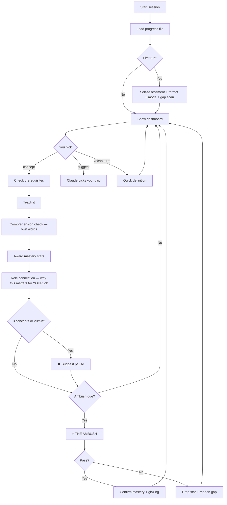

# GapHunter

> The adaptive AI teacher that finds your weak spots and fills them —
> for developers, PMs, QA engineers, designers, and complete beginners.

Works on **Claude Code, Cursor, GitHub Copilot, Gemini CLI, JetBrains AI**,
and any LLM agent. Exports to **NotebookLM** after every session.

---

## For Everyone

GapHunter is not just for developers. It adapts to who you are:

| Role | What you get |
|------|-------------|
| Junior Dev | Analogies, patience, encouragement |
| Mid-level Dev | Balanced depth, real-world examples |
| Senior Dev | Dense mode, edge cases, no hand-holding |
| Team Lead | Architecture and team implications |
| Product Manager | Business analogies, understand WHY devs say what they say |
| QA Engineer | Connect concepts to quality, testing, and deploy pipelines |
| Designer | Visual analogies, understand components and constraints |
| ADHD / Dyslexia | Short chunks, bold terms, no walls of text |
| Complete Beginner | Zero assumed knowledge, everyday analogies only |

---

## How It Works



---

## ⏳ Learn While You Wait

AI generating code? Tests running? Build in progress?

Instead of switching tabs:

> `"teach me event-loop"`

3 minutes. One concept. Real retention. Streak maintained.

GapHunter is built for exactly this — short bursts that compound
into deep knowledge over time.

---

## 📓 NotebookLM Friendly

After every session, GapHunter generates a clean structured digest
you can paste directly into NotebookLM as a source document.

Then ask NotebookLM to quiz you, summarize, or explain further.
Perfect for ADHD learners who want to revisit concepts in a different format.

Type `export session` at any time to generate your digest.

---

## Install

### Claude Code
```bash
mkdir -p ~/.claude/skills/gaphunter
curl -o ~/.claude/skills/gaphunter/SKILL.md \
  https://raw.githubusercontent.com/petrbui/GapHunter/main/SKILL.md
```

### Cursor / GitHub Copilot / Other agents
Copy `SKILL.md` to your agent's skills directory, then invoke with:
> `"Use the gaphunter skill to teach me [concept]"`

---

## Usage

| Say | Action |
|-----|--------|
| `teach me closures` | Start a lesson |
| `suggest` | Claude picks your next gap |
| `skip closures` | Quick verify → mark as known |
| `vocab API` | Plain-English definition, no full lesson |
| `ambush me` | Fire The Ambush now |
| `my progress` | Show dashboard |
| `export session` | Generate NotebookLM digest |
| `switch to visual mode` | Change teaching style |
| `continue` | Override a pause |
| `reset profile` | Start fresh |

---

## Teaching Styles

| Style | Best for |
|-------|---------|
| 📱 ADHD/Dyslexia | Short chunks, bold terms, no walls of text |
| 📖 Standard | Balanced depth |
| ⚡ Dense | Seniors, no hand-holding |
| 🧠 Socratic | Learn by being questioned |
| 🎨 Visual | ASCII diagrams, tables, flow charts |

Switch anytime: `"switch to visual mode"`

---

## Safety

- Progress saved to `~/.adaptive-teacher-progress.md` — fixed path,
  never user-supplied
- Stores only: topic names, stars, dates, achievement slugs
- No code, no secrets, no personal data ever stored
- Light Mode: zero file access
- Deep Mode: never reads `.env`, credentials, keys, or secret files
- Delete the progress file anytime to fully reset — no data elsewhere

---

## License

MIT — free to use, fork, and share.
